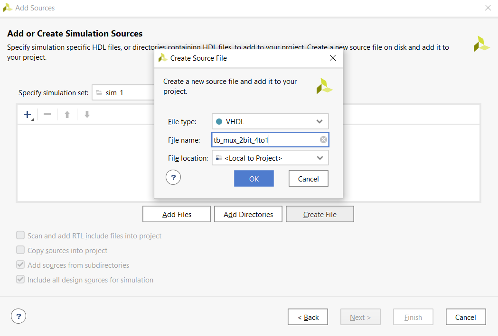
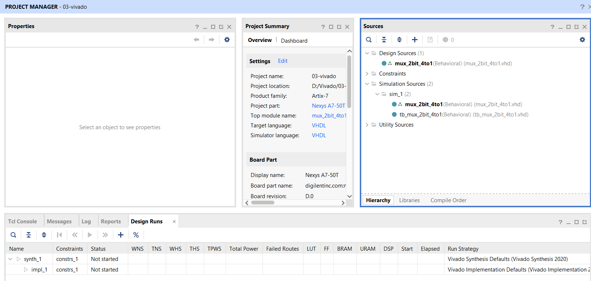

# Lab 03-vivado

## GitHub: 

https://github.com/mvvelja/Digital-electronics-1

## Table with connection of 16 slide switches and 16 LEDs on Nexys A7 board

| **LED** | **Connection** | **Switch** | **Connection** | 
| :-: | :-: | :-: | :-: |
| LED0 | H17 | SW0 | J15 |
| LED1 | K15 | SW1 | L16 |
| LED2 | J13 | SW2 | M13 |
| LED3 | N14 | SW3 | R15 |
| LED4 | R18 | SW4 | R17 |
| LED5 | V17 | SW5 | T18 |
| LED6 | U17 | SW6 | U18 |
| LED7 | U16 | SW7 | R13 |
| LED8 | V16 | SW8 | T8 |
| LED9 | T15 | SW9 | U8 |
| LED10 | U14 | SW10 | R16 |
| LED11 | T16 | SW11 | T13 |
| LED12 | V15 | SW12 | H6 |
| LED13 | V14 | SW13 | U12 |
| LED14 | V12 | SW14 | U11 |
| LED15 | V11 | SW15 | V10 |

## 2-bit wide 4-to-1 multiplexer

### Listing of VHDL architecture from source file mux_2bit_4to1.vhd

**VHDL code**
```vhdl
architecture Behavioral of mux_2bit_4to1 is
begin
    f_o <= a_i when (sel_i = "00") else
           b_i when (sel_i = "01") else
           c_i when (sel_i = "10") else
           d_i; 
           
end architecture Behavioral;
```

### Listing of VHDL stimulus process from testbench file tb_mux_2bit_4to1.vhd

**VHDL code**
```vhdl
p_stimulus : process
    begin
        -- Report a note at the begining of stimulus process
        report "Stimulus process started" severity note;

        s_d <= "00"; s_c <= "00"; s_b <= "00"; s_a <= "00"; s_sel <= "00"; wait for 100 ns;
        
        s_a <= "00"; wait for 100 ns;
        s_b <= "01"; wait for 100 ns;
        
        s_sel <= "01"; wait for 100 ns;
        s_c   <= "00"; wait for 100 ns;
        s_b   <= "11"; wait for 100 ns;  
        
        s_d   <= "11";  s_c <= "11"; s_b <= "01"; s_a <= "00"; 
        s_sel <= "10"; wait for 100 ns;  
        
        s_d   <= "00";  s_c <= "00"; s_b <= "00"; s_a <= "01"; 
        s_sel <= "10"; wait for 100 ns;  
        
        s_d   <= "11";  s_c <= "11"; s_b <= "01"; s_a <= "00"; 
        s_sel <= "11"; wait for 100 ns;  
               
        -- Report a note at the end of stimulus process
        report "Stimulus process finished" severity note;
        wait;
    end process p_stimulus;
```

### Simulated time waveforms


## Vivado creating project TUTORIAL

### 1) Vivado 2020.2 ---> "Create Project"


### 2) Click on "Next"


### 3) Name your project and select location ---> "Next"


### 4) RTL Project as default ---> "Next"


### 5) Click on "Create File" than name your Source file ---> "OK" (Do not forget to change "Target language" and "Simulator language" to VHDL)


### 6) Next window just skip (Next)


### 7) Select "Boards" on top of the window and choose "Nexys A7-50T" ---> "Next"


### 8) Check Project summary ---> "Finish"


### 9) Pop-up window skip (OK)


### 10) File -> Add Sources (or Alt + A), "Add or create simulation sources" ---> "Next" (Testbench for us)


### 11) Name your Source File ---> "OK" (skip pop-up window)


### 12) Successfully added Testbench file ---> We can now do the our work!

